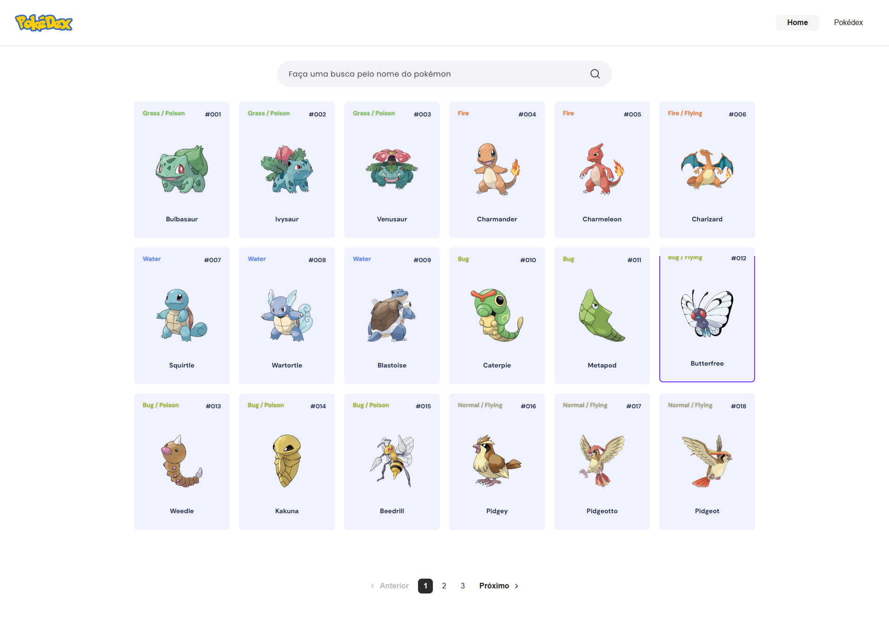
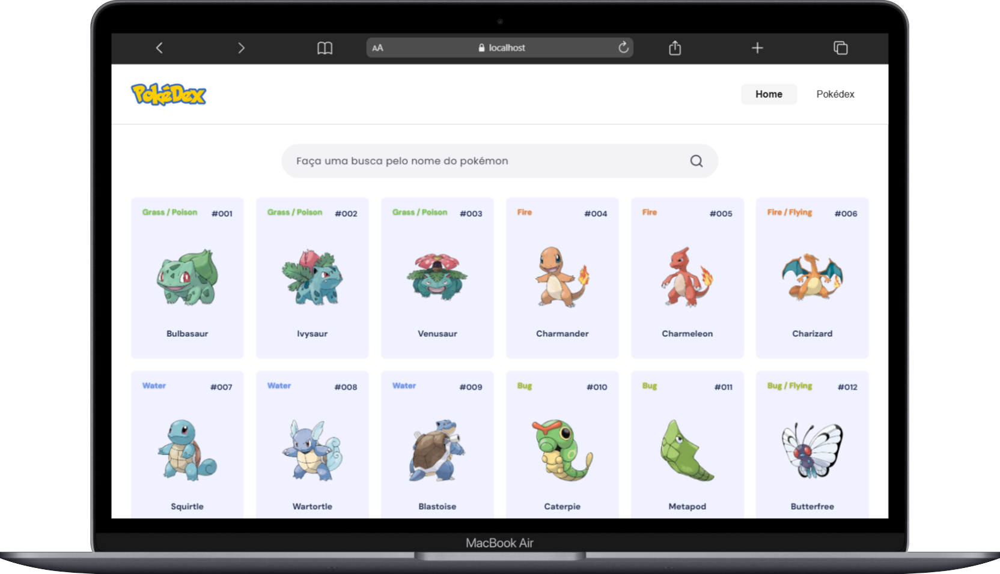
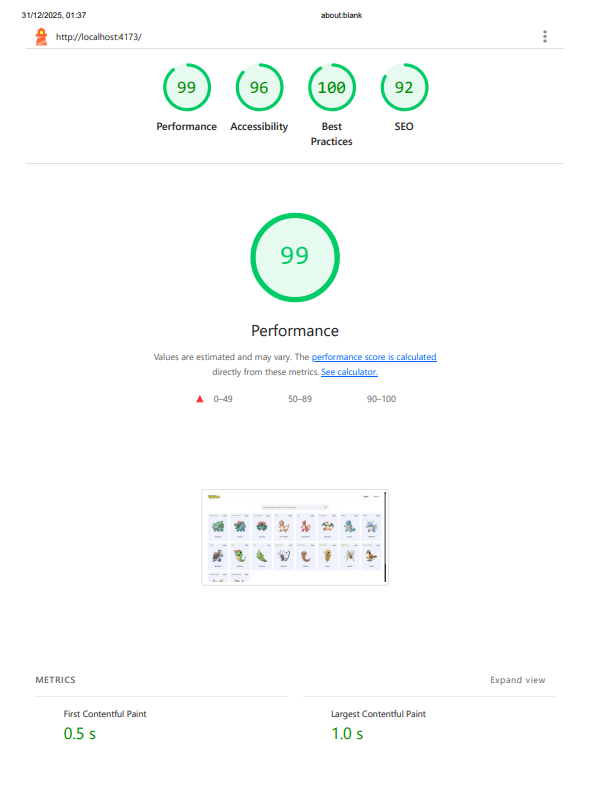

# Lumis Challenge - Pokédex SPA



> Solução desenvolvida para o desafio técnico de Front-End da Lumis. Uma aplicação Single Page Application (SPA) reativa e performática para consulta de Pokémons.

## 🚀 Deploy

### **[🔗 Ver Aplicação Online](https://my-pokedex-flame.vercel.app)**

---

## 🛠️ Stack Tecnológica

[](https://www.typescriptlang.org/)
[](https://vitejs.dev/)
[](https://vercel.com)
[](https://playwright.dev/)

---

## 📱 Preview e Responsividade

A interface foi desenhada com abordagem **Mobile First**, garantindo fluidez em qualquer dispositivo.

| Desktop View | Mobile Experience |
|:---:|:---:|
|  |  |

---

## ⚡ Performance (Lighthouse)

O projeto foi otimizado para atingir métricas de alta performance, acessibilidade e SEO.



---

## 🧠 Decisões Arquiteturais

Embora o desafio permitisse o uso de Vanilla JS puro, a escolha estratégica pelo **TypeScript** compilado via **Vite** baseou-se em três pilares:

1. **Robustez e Type Safety:** O uso de interfaces estritas (`src/domain`) previne erros de runtime comuns ao consumir APIs externas (PokéAPI), garantindo que dados nulos ou indefinidos não quebrem a interface.

2. **Escalabilidade (Separation of Concerns):** A arquitetura foi desacoplada para simular um ambiente real de produto:
   - **Store:** Gerenciamento de estado reativo isolado da UI.
   - **Services:** Camada de adaptação e comunicação com a API.
   - **Components:** Funções puras focadas apenas em renderização.

3. **Developer Experience (DX) vs. User Experience (UX):** O TypeScript oferece segurança durante o desenvolvimento, mas o build final entrega **Vanilla JS otimizado e minificado**, atendendo integralmente ao requisito de performance no navegador do cliente.

### Otimizações Implementadas

- **Debounce Pattern:** Implementado na busca (`src/utils`) para mitigar requisições excessivas à API (300ms delay).
- **Gestão de Erros:** Fallbacks visuais para imagens quebradas e tratamento de falhas de conexão.

---

## 🛠️ Instalação e Execução

Este projeto utiliza **pnpm** para gerenciamento eficiente de pacotes.

### Pré-requisitos

- Node.js (v18 ou superior)
- pnpm (`npm install -g pnpm`)

### Passo a passo

**1. Clone o repositório**

```bash
git clone https://github.com/CodeDeivid/my-pokedex.git
cd my-pokedex
```

**2. Instale as dependências**

```bash
pnpm install
```

**3. Execute em ambiente de desenvolvimento**

```bash
pnpm dev
```

O projeto estará disponível em `http://localhost:5173`.

**4. Build de Produção**

Para gerar os arquivos estáticos otimizados (Vanilla JS):

```bash
pnpm build
```

Para visualizar o build final localmente:

```bash
pnpm preview
```

---

## ✅ Testes Automatizados (E2E)

O projeto conta com cobertura de testes End-to-End utilizando **Playwright**, garantindo que fluxos críticos (carregamento, busca, paginação) funcionem conforme o esperado.

Para rodar os testes no terminal (Headless):

```bash
pnpm test:e2e
```

Para rodar os testes com interface visual (Modo UI):

```bash
pnpm test:ui
```

---

## 📂 Estrutura do Projeto

```text
src/
├── components/      # Componentes visuais reutilizáveis
├── domain/          # Definições de Tipos e Interfaces
├── services/        # Integração com PokéAPI
├── store/           # Gerenciamento de Estado (State Pattern)
├── styles/          # Variáveis CSS e estilos globais
├── utils/           # Funções auxiliares (Debounce, Formatters)
├── app.ts           # Controller principal (Lógica de UI)
└── main.ts          # Entry Point
tests/               # Testes E2E com Playwright
```

---

## 👨‍💻 Autor

**Deivid Micael**

---

## 📄 Licença

Este projeto foi desenvolvido como parte de um desafio técnico.